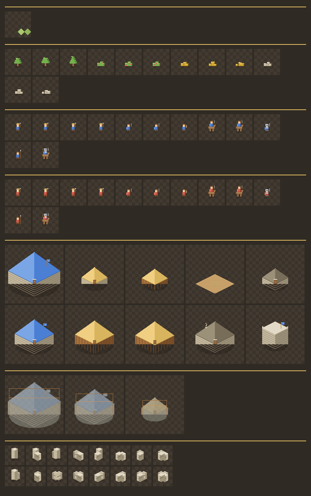

# Direction artistique

Charte graphique du jeu, et mode d'emploi de la chaîne de production des
sprites. C'est la traduction du GDD §10 en règles applicables.

```bash
npm run sprites     # régénère docs/sprites.png, la planche de référence
```



---

## 1. Le parti pris

**Pixel art 8-bit minimaliste, tons chauds et pastel, ambiance estivale.**
L'inverse de l'austérité grise habituelle du médiéval : on doit avoir envie
d'y passer une après-midi, pas d'y survivre.

Trois conséquences pratiques :

- **Peu de pixels par entité.** Une unité tient dans 20 × 26. C'est ce qui rend
  la production tenable en solo, et ce qui force à ne garder que l'essentiel.
- **Aucun dégradé, aucun anticrénelage.** Chaque pixel est posé franchement. À
  cette taille, une transition douce se lit comme une tache sale.
- **La lisibilité prime sur le détail.** Un joueur doit reconnaître une unité
  sans lire son nom, et distinguer un allié d'un ennemi au premier coup d'œil.

---

## 2. La palette

Elle vit dans `src/art/palette.ts` — c'est elle, la source de vérité, pas ce
document.

**Rien ne se dessine hors de la palette.** Une couleur inventée au fil d'un
sprite est exactement ce qui fait dériver une direction artistique. Si une
teinte manque, elle s'ajoute au fichier, nommée, et devient disponible partout.

**Trois valeurs par matériau** — claire, moyenne, sombre. Deux ne suffisent pas
à donner du volume ; quatre brouillent la lecture à cette taille.

| Famille | Usage |
|---|---|
| `grass*` | Sol, en quatre valeurs très proches |
| `wood*` | Charpentes, troncs, manches d'outils |
| `stone*` | Maçonnerie, rochers, murailles |
| `thatch*` | Toits de chaume, chapeaux de paille |
| `leaf*` | Feuillages, buissons, cultures |
| `gold*`, `berry*` | Ressources, où la couleur **est** l'information |
| `skin*`, `cloth*`, `steel*` | Personnages |
| `outline` | Contour unique de toutes les entités |

### Les couleurs de royaume ne servent qu'à l'appartenance

Saphir `#4a7fd4`, Rubis `#d45a4a`, chacune avec sa version claire et sombre.
Elles se posent sur les toits, les tuniques et les bannières — **jamais sur un
matériau**. Un toit bleu veut dire « à moi », pas « en ardoise ».

---

## 3. Les règles qui font tenir l'ensemble

**La lumière vient du nord-ouest.** Toujours. Face gauche claire, face droite
dans l'ombre, sur chaque entité du jeu sans exception. C'est la règle la plus
importante du lot : dès qu'une seule entité l'enfreint, elle semble flotter.

**Un contour d'un pixel, de la même couleur pour tout.** Il est appliqué en fin
de dessin, automatiquement, par `PixelCanvas.outline()`. C'est ce qui détache
les entités du sol sans qu'aucune n'ait besoin d'être assombrie.

**Une ombre portée elliptique au sol** sous chaque entité, à 18 % d'opacité.
Sans elle, tout paraît suspendu à un centimètre du décor.

**Chaque sprite a un point d'ancrage** : le pixel qui se pose sur le centre de
la tuile. Les pieds pour une unité, le centre du socle pour un bâtiment. C'est
lui qui aligne tout le monde sur la grille.

---

## 4. Le vocabulaire visuel des unités

Les douze unités ne sont pas dessinées une par une : leur silhouette découle de
leurs caractéristiques de jeu. Un joueur doit lire une armée **sans infobulle**.

| Signe | Sens |
|---|---|
| Monture | cavalerie |
| Casque fermé, plastron d'acier | armure lourde |
| Arc tenu devant | unité à distance |
| Hampe dépassant la tête | arme d'hast, anti-cavalerie |
| Chapeau de paille, outil | paysan |
| Bannière | porte-étendard |
| Bouclier aux couleurs du royaume | infanterie de mêlée |

La tunique porte toujours la couleur du royaume.

---

## 5. L'architecture

Tous les bâtiments partagent le même squelette — socle isométrique, murs, toit
— et ne se distinguent que par leur matériau, leur hauteur et deux ou trois
détails. C'est ce qui donne un village qui se tient plutôt qu'une collection
d'objets sans rapport.

Le tableau `STYLES` dans `src/art/buildings.ts` est court à dessein : ce sont
les seules décisions esthétiques à prendre par bâtiment, tout le reste découle
de son emprise au sol.

Deux exceptions assumées :

- **La ferme n'est pas un bâtiment** mais une parcelle labourée. On récolte
  dessus, on n'y entre pas — une énième cabane aurait été à la fois moins juste
  et moins lisible.
- **La tour de garde n'a pas de toit** : c'est une plateforme crénelée, ce qui
  la rend immédiatement reconnaissable malgré sa petite emprise.

### Les murailles se raccordent

Chaque segment tend un bras vers le milieu de chaque côté partagé avec une
voisine : deux segments adjacents se rejoignent exactement et le mur est
continu. Les seize raccordements possibles sont dessinés et mis en cache.

Une tour marque les **extrémités** et les segments isolés, jamais les angles :
en mettre partout transformait une enceinte en chapelet de tours où l'on ne
distinguait plus le tracé.

---

## 6. Le décor

Les gisements forment des zones d'un seul tenant, donc on en voit des dizaines
côte à côte. Deux conséquences :

- **Trois variantes par ressource**, choisies d'après la position sur la carte.
  Un seul motif répété cent fois donne un papier peint, pas une forêt. Le choix
  est déterministe — indispensable en multijoueur, où deux clients doivent
  afficher la même chose.
- **Des silhouettes compactes**, qui débordent peu de leur tuile, sinon une
  masse d'arbres devient une bouillie.

Le sol est un motif de 32 × 16 pixels répété sur toute la carte. C'est le plus
petit pavé qui se répète sans couture dans une grille isométrique : décaler de
32 pixels revient à avancer de deux tuiles en x, décaler de 16 revient à
avancer d'une tuile en x et une en y — deux déplacements qui conservent le
damier. Les losanges qui dépassent du pavé rentrent par le côté opposé.

---

## 7. La chaîne de production

```
src/art/
  palette.ts    La palette — source de vérité des couleurs
  canvas.ts     Toile de pixels et primitives de dessin
  units.ts      Les douze unités
  buildings.ts  Les bâtiments et les murailles
  nature.ts     Sol, arbres, buissons, filons
  index.ts      Catalogue et cache
```

**L'art ne dépend ni de PixiJS ni du navigateur.** Il produit des tampons RGBA.
Le même code sert à fabriquer les textures du jeu (`src/render/textures.ts`) et
à exporter la planche de référence depuis Node (`npm run sprites`). Les deux
voient exactement la même chose, ce qui évite qu'une planche « de production »
finisse par mentir sur le jeu.

`docs/sprites.png` est le document de contrôle : tout s'y regarde d'un coup
d'œil, et une incohérence de style, de palette ou d'échelle y saute aux yeux
bien mieux qu'en jouant.

### Ajouter un sprite

1. Écrire la fonction de dessin dans le fichier de sa famille.
2. L'ajouter au `catalogue()` de `src/art/index.ts`.
3. `npm run sprites` et regarder la planche.

Aucune image n'est stockée dans le dépôt : tout est reconstruit à partir du
code. Un sprite se corrige donc en changeant deux nombres, pas en rouvrant un
éditeur d'images.

---

## 8. Ce qui reste à faire

Cette passe fige le style et couvre tout le jeu. Manquent encore, par ordre
d'importance :

1. **L'animation.** Tout est figé : pas de cycle de marche, pas de geste
   d'attaque, pas de balancement des arbres. C'est le prochain grand chantier
   visuel, et le plus coûteux.
2. **Les directions.** Une unité est vue de face quel que soit son cap. Un RTS
   isométrique en demande normalement huit — soit huit fois le travail.
3. **Les états de dégât** des bâtiments : fissures, toit crevé, fumée.
4. **Les transitions de terrain** : lisières de forêt, chemins, berges.
5. **Les effets** : impact de flèche, poussière, effondrement.
